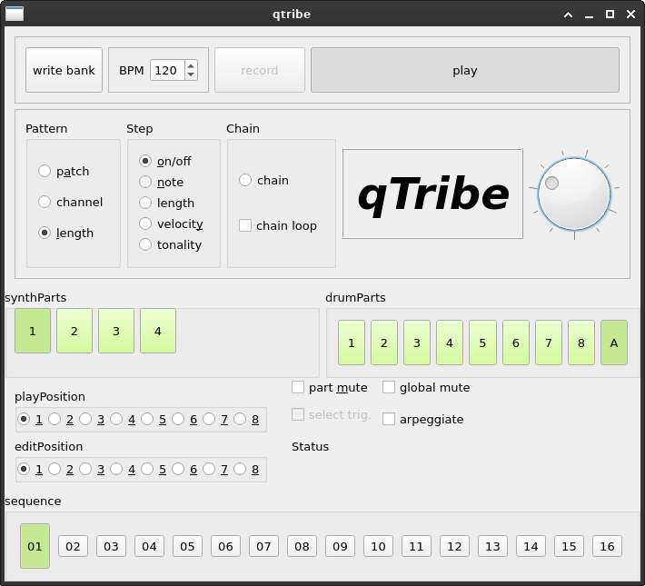

# qtribe_pro
This is a fork of the qTribe sequencer in Qt5.

The qTribe project was created by Pete Black ( http://sourceforge.net/projects/qtribe )

Work in prgress

## History
2022-02-13 got step sequencer to work for drum patterns, no visualizing of running steps in UI yet

## TODO
- signaling between step sequencer thread and ui to get information about steps
- synthpart to set midi signals
- editing mode for notes in Sequence
- recording sequencences from Midi 
